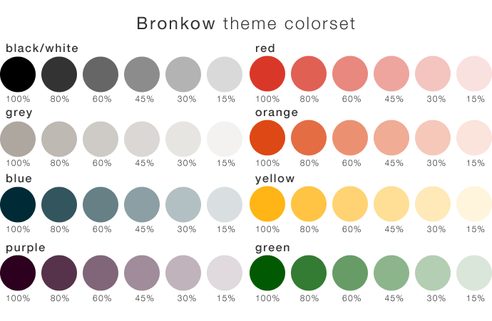

# Bronkow Colorscheme for Vim



## Summary
This color scheme based on the [Ubuntu colour palette](http://design.ubuntu.com/brand/colour-palette).
You can choose between a dark and a light versions (GUI and 256 color terminal).

A colorscheme for the [Powerline](https://github.com/Bronkow/vim-powerline/network)
plugin is integrated as well.

## Description
The light version of the scheme is set by default. You can change this by
setting the `g:bronkow_style` variable to "light" or "dark". Once the color scheme is
loaded, you can use the commands `:BronkowLight` or `:BronkowDark`,
 to change schemes quickly.

## Installation
You can use [pathogen.vim](https://github.com/tpope/vim-pathogen) for a
simple installation or you go the old fashion way:

1. Clone the repository

  ```bash
  git clone git://github.com/cange/vim-theme-bronkow.git
  cd vim-theme-bronkow/
  ```
2. Create a simlink to your Vim directory

  ```bash
  ln -s colors/bronkow.vim ~/.vim/colors/
  ```
3. Put this line in your `.vimrc` file

  ```bash
  colorscheme bronkow
  ```
4. Restart Vim

## TODOs
- adjust 256 based colors
- add some screenshots

## Extras

- Ubuntu: [dark colors for Terminator ](https://github.com/cange/vim-theme-bronkow/blob/master/extras/Bronkow%20dark.itermcolors)
- Mac OS: [dark colors for iTerm 2 ](https://github.com/cange/vim-theme-bronkow/blob/master/extras/terminator/config)
