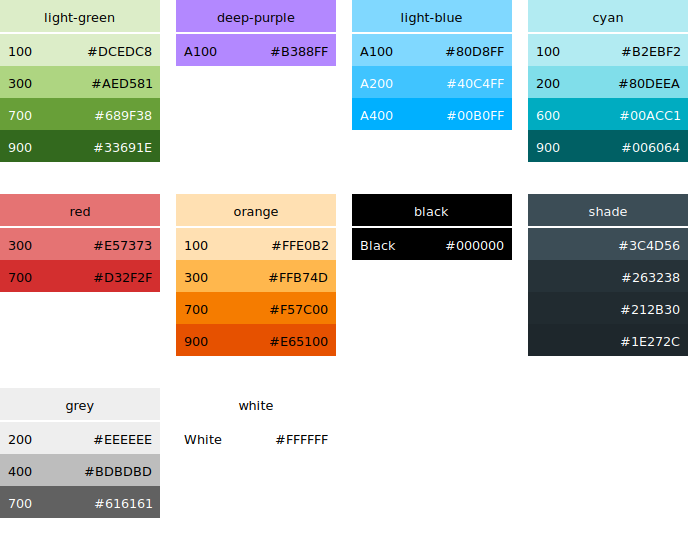

# Vim Bronkow Theme based on Material Design

This is a Vim color scheme based on [Google’s Material Design Color Palette](https://material.io/guidelines/style/color.html).



## Installation

This plugin follows the standard runtime path structure, and as such it can be installed with a variety of plugin managers:

1. Download
  *  [Pathogen](https://github.com/tpope/vim-pathogen)
      *  `git clone https://github.com/cange/vim-theme-bronkow ~/.vim/bundle/vim-theme-bronkow`
  *  [Vundle](https://github.com/gmarik/vundle)
      *  `Plugin 'cange/vim-theme-bronkow'`
  * or other package manager

3. Enable theme in your `.vimrc`

  ```bash
  colorscheme bronkow_material
  ```
4. Restart Vim or run `so ~/.vimrc` in Vim

## Recommended iTerm2 theme
- [iterm2-material-design](https://github.com/MartinSeeler/iterm2-material-design)
